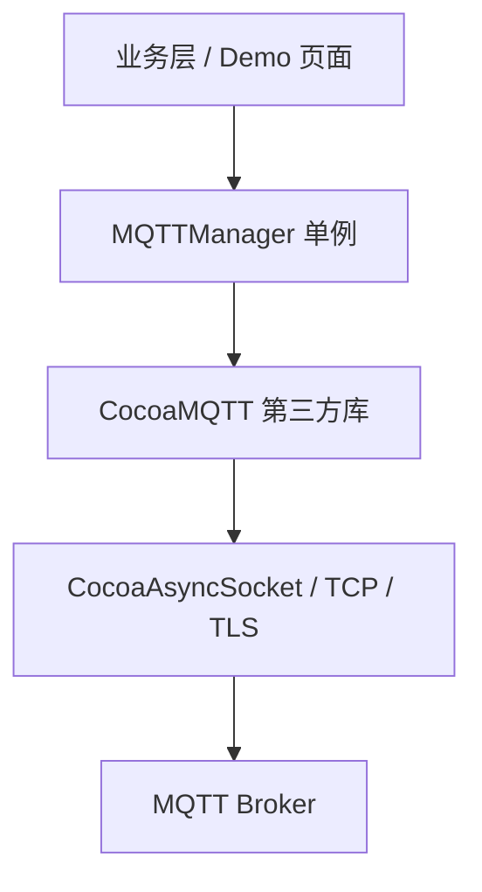
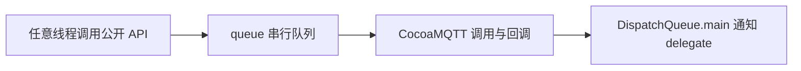
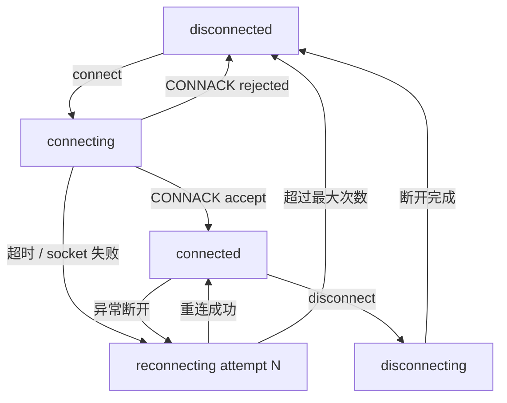

# MQTTManager 设计文档

> iOS 端 MQTT 通信管理模块：对第三方库 [CocoaMQTT](https://github.com/emqx/CocoaMQTT) 的二次封装。
> 设计模式与同目录蓝牙模块 [BluetoothManager](../Bluetooth/BluetoothManager.md) 完全对齐：单例 + 专用串行队列 + weak delegate + 状态机 + 指标统计。

---

## 一、模块定位与职责

### 1.1 为什么需要二次封装

业务层直接使用 CocoaMQTT 存在几个问题：

| 直接使用的问题 | 封装后的收益 |
|----------------|--------------|
| 业务代码散落 CocoaMQTT 类型（`CocoaMQTTQoS`/`CocoaMQTTMessage`） | 外部只接触自定义模型，底层库可整体替换 |
| 库自带 `autoReconnect` 无随机抖动、无次数上限 | 自管理 equal-jitter 指数退避，避免惊群效应，超限兜底 |
| 断线期间的发布请求直接失败 | 可选离线缓存，重连成功后自动补发（QoS1/2） |
| 断线重连后订阅关系丢失 | 自动恢复断线前的全部订阅 |
| 认证失败等 CONNACK 拒绝也会被当作异常断开重连 | 应用层拒绝不重连，直接报错（避免无效重试被 Broker 封禁） |
| 无连接超时保护、无指标统计 | 内置超时、耗时/收发计数/重连次数统计 |

### 1.2 主要职责

1. **连接管理** —— `connect` / `disconnect`，连接超时保护，异常断开自动重连（指数退避 + 随机抖动）
2. **消息收发** —— `publish` / `subscribe` / `unsubscribe`，支持 QoS 0/1/2 与 retained 消息
3. **状态管理** —— 连接状态机（NSLock 线程安全），weak delegate 多点监听
4. **订阅恢复** —— 重连成功后自动恢复断线前的全部订阅
5. **离线缓存** —— 未连接时 QoS1/2 消息可入离线缓存，重连成功后自动补发
6. **指标统计** —— 连接耗时、收发消息数、收发字节数、重连次数

### 1.3 与蓝牙封装的边界：哪些没有照搬

MQTT 跑在 TCP 上，传输可靠性由 TCP 与 MQTT 协议本身保证，因此蓝牙封装里的以下机制**本模块不需要**：

- 应用层帧头 + CRC 校验（BLE 丢包/粘包才需要，TCP 流式可靠传输已由协议保证）
- 应用层 ACK + 超时重试 + 分片组包（MQTT 的 QoS1/2 协议级确认由 CocoaMQTT 内部 deliver 窗口处理）
- MTU 适配与断点续传（MQTT 无 MTU 概念，长连接不存在"续传"语义）

---

## 二、架构设计

### 2.1 分层结构



- **业务层**：只依赖 `MQTTManager` 与自定义模型（`MQTTConfiguration`、`MQTTMessage`、`MQTTQoS`），不 import CocoaMQTT
- **封装层**（本模块）：状态机、重连、超时、订阅恢复、指标、线程切换
- **第三方层**：CocoaMQTT 负责 MQTT 协议编解码与 socket 管理

### 2.2 线程模型



- socket 事件与大部分 CocoaMQTT delegate 回调通过 `client.delegateQueue = queue` 绑定到专用串行队列 `com.testdemo.mqtt.manager`
- 但发布确认（didPublishMessage）等回调来自库内部 deliver 队列，因此所有回调入口统一经 `DispatchSpecificKey` 检测后调度到 `queue`：已在 queue 上直接执行，否则 async 转入
- 公开 API 同样支持任意线程调用（含 queue 自身，`onQueueSync` 避免 sync 死锁，业务方可在 delegate 回调里直接发布消息）
- 对外 delegate 通知统一切回主线程，使用方无需关心线程切换
- 连接状态机读写通过 NSLock 保护，支持任意线程读取

> **为什么不用主线程队列（简化版）**：CocoaMQTT 默认 `delegateQueue = main`，不设置时 socket 事件与协议解析都在主线程——低负载下也能工作，封装层甚至可以砍掉整条 queue。但高频消息时协议解析会占用主线程，且状态机失去串行保护，生产环境不推荐。

### 2.3 连接状态机



| 状态 | 含义 |
|------|------|
| `disconnected` | 空闲未连接 |
| `connecting` | 正在建立连接（等待 CONNACK） |
| `connected` | 已连接，可正常收发 |
| `reconnecting(attempt:)` | 异常断开后等待/执行第 N 次重连 |
| `disconnecting` | 正在主动断开 |

> 竞态防护：`disconnecting` 状态下到达的迟到 CONNACK 会被忽略（防止覆盖为主动断开状态后误触发重连）；`disconnected` 状态下到达的迟到断开回调会被忽略（防止重连耗尽后的重复通知）。

> 库自带的 `connState` 只有 disconnected/connecting/connected 三态，缺少 `reconnecting` 与 `disconnecting`，业务 UI 无法区分"重连中"与"未连接"，因此封装层自维护五态状态机。

### 2.4 自动重连策略（equal-jitter 指数退避）

关闭库自带的 `autoReconnect`，由封装层自管理：

- 第 N 次重连的基准延迟：`fullDelay = reconnectBaseDelay × 2^(N-1)`（默认 1s → 2s → 4s → 8s → 16s），并以 `reconnectMaxDelay`（默认 60s）封顶
- 最终延迟加入随机抖动：`delay = fullDelay / 2 + random(0, fullDelay / 2)`
- 抖动可避免多台设备同时断线后同步重连导致的 Broker 惊群效应
- 超过 `reconnectMaxAttempts`（默认 5 次）后进入 `disconnected` 并上报 `reconnectExhausted` 错误
- **主动断开不触发重连**；Broker 拒绝连接（认证失败等 CONNACK 非 accept）属于应用层拒绝，**也不重连**——这是与蓝牙连接模型的本质差异，认证失败重试无意义且可能被 Broker 封禁
- 重连成功后自动恢复 `activeSubscriptions` 中记录的全部订阅，并补发离线缓存消息
- 首轮连接与每次重连尝试均受 `connectTimeout` 超时保护

> **为什么不用库自带的 autoReconnect**：库的实现也是指数退避（间隔 ×2 至 128s 封顶），能满足基础场景；但它没有随机抖动（多设备同步重连会冲击 Broker）、没有次数上限（永久重试）、不暴露"第几次尝试"状态。自管理换来这三点能力，是刻意的复杂度取舍。

---

## 三、核心概念

### 3.1 服务质量（MQTTQoS）

| 等级 | 语义 | 适用场景 |
|------|------|----------|
| `atMostOnce` (0) | 最多投递一次，可能丢失 | 高频实时数据（传感器上报） |
| `atLeastOnce` (1) | 至少投递一次，可能重复 | 常规业务消息（默认） |
| `exactlyOnce` (2) | 恰好投递一次，开销最大 | 支付/指令等强一致场景 |

### 3.2 连接配置（MQTTConfiguration）

| 字段 | 默认值 | 说明 |
|------|--------|------|
| `host` | broker.emqx.io | Broker 地址（默认为 EMQX 公共测试 Broker，仅用于演示） |
| `port` | 1883 | 端口（1883 明文 / 8883 TLS） |
| `clientID` | ios-xxxxxxxx | 客户端唯一标识，同一 Broker 下重复会互相挤下线 |
| `username` / `password` | nil | 认证凭据（可选） |
| `keepAlive` | 60 | 心跳间隔（秒） |
| `cleanSession` | true | 干净会话：断线后 Broker 是否保留订阅与离线消息 |
| `enableTLS` | false | 是否启用 TLS（端口需配套改为 8883） |
| `connectTimeout` | 10 | 连接超时（秒） |
| `reconnectMaxAttempts` | 5 | 最大重连次数 |
| `reconnectBaseDelay` | 1 | 重连基础延迟（秒），按指数退避增长 |
| `reconnectMaxDelay` | 60 | 重连延迟上限（秒），退避延迟超过后不再增长 |
| `willMessage` | nil | 遗嘱消息：异常断开时由 Broker 代为发布 |
| `allowUntrustCA` | false | 是否信任自签名 CA 证书（仅 TLS，**生产慎用**） |
| `inflightWindowSize` | 10 | 未确认 QoS1/2 消息的在途窗口大小 |
| `messageQueueSize` | 1000 | QoS1/2 消息发送队列上限，满时新消息被丢弃 |
| `cacheOfflineMessages` | true | 未连接时 QoS1/2 发布请求是否入离线缓存 |
| `offlineMessageLimit` | 100 | 离线缓存上限，超出丢弃最旧消息 |

### 3.3 消息模型（MQTTMessage）

| 字段 | 说明 |
|------|------|
| `topic` | 主题（订阅时支持 `+` 单层与 `#` 多层通配符） |
| `payload` | 二进制消息体 |
| `qos` | 服务质量等级 |
| `retained` | 保留消息：Broker 为该 topic 保留最后一条，新订阅者立即可收到 |
| `messageID` | 消息 ID（QoS0 恒为 0） |
| `timestamp` | 消息产生/到达时间戳 |
| `string` | payload 的 UTF-8 字符串表示（计算属性） |

### 3.4 离线缓存策略

| 场景 | 行为 |
|------|------|
| 已连接时 publish | 直接发送，返回 messageID（QoS0 恒为 0） |
| 未连接时 publish QoS1/2 且缓存开启 | 入离线缓存，返回 **-2**，重连成功后自动补发 |
| 未连接时 publish QoS0 | 实时消息直接丢弃，上报 `notConnected`，返回 **-1** |
| 缓存满（达到 `offlineMessageLimit`） | 丢弃最旧的消息后入队 |
| 主动 disconnect | 缓存**保留**，下次连接成功后仍会补发 |

> QoS0 不缓存的原因：QoS0 语义是"最多一次、发出去就不管"，断线重发违背其实时性定位；
> QoS1/2 已发出但未收到 ACK 的消息由 CocoaMQTT 内部 deliver 窗口自动重发，本层只缓存"未连接时的发布请求"。

### 3.5 运行时指标（MQTTMetricSnapshot）

| 指标 | 含义 |
|------|------|
| `connectStartedAt` | 连接开始时间戳 |
| `connectedAt` | 收到 CONNACK 时间戳 |
| `connectionCost` | 连接耗时（秒）= connectedAt - connectStartedAt |
| `reconnectAttempts` | 已尝试重连次数 |
| `publishedCount` / `receivedCount` | 已发布/接收消息条数 |
| `transmittedBytes` / `receivedBytes` | 已发送/接收字节数（仅统计 payload） |

---

## 四、API 参考

### 4.1 连接管理

```swift
// 1. 更新配置（可在任意线程调用，已连接时下次 connect 生效）
MQTTManager.shared.update(configuration: MQTTConfiguration(
    host: "broker.emqx.io",
    port: 1883,
    clientID: "ios-demo-001",
    keepAlive: 60,
    cleanSession: true,
    willMessage: MQTTMessage(
        topic: "device/ios-demo-001/status",
        payload: Data("offline".utf8),
        qos: .atLeastOnce
    )
))

// 2. 建立连接（异常断开自动重连）
MQTTManager.shared.connect()

// 3. 主动断开（不触发自动重连）
MQTTManager.shared.disconnect()
```

### 4.2 消息收发

```swift
// 订阅（支持通配符），断线期间的订阅会在重连成功后自动恢复
MQTTManager.shared.subscribe(topic: "device/+/status", qos: .atLeastOnce)

// 发布字符串 / 二进制消息
MQTTManager.shared.publish("Hello", topic: "device/ios-demo-001/msg", qos: .atLeastOnce, retained: false)
MQTTManager.shared.publish(Data([0x01, 0x02]), topic: "device/ios-demo-001/raw")

// 取消订阅
MQTTManager.shared.unsubscribe(topic: "device/+/status")
```

### 4.3 状态查询

```swift
MQTTManager.shared.isConnected        // 是否已连接
MQTTManager.shared.connectionState    // 连接状态机（线程安全读取）
MQTTManager.shared.currentHost        // 当前 Broker 地址
MQTTManager.shared.subscribedTopics   // 当前生效的订阅列表
MQTTManager.shared.offlineOutboxCount // 离线缓存待补发消息条数
```

### 4.4 其他

```swift
MQTTManager.shared.ping()          // 手动心跳（库已自动保活，仅供调试）
MQTTManager.shared.resetMetrics()  // 重置运行时指标
```

> **publish 返回值约定**：>= 0 为 messageID（QoS0 恒为 0）；**-1** 发布失败（未连接且未缓存）；**-2** 已入离线缓存待补发。

---

## 五、Delegate 回调

```swift
protocol MQTTManagerDelegate: AnyObject {
    // 连接状态机变化（connecting → connected → reconnecting 等）
    func mqttManager(_ manager: MQTTManager, didChangeConnectionState state: MQTTConnectionState)

    // 连接成功（收到 Broker CONNACK）
    func mqttManager(_ manager: MQTTManager, didConnect host: String, port: UInt16)

    // 连接断开（主动或异常）
    func mqttManager(_ manager: MQTTManager, didDisconnect error: Error?)

    // 收到订阅消息
    func mqttManager(_ manager: MQTTManager, didReceive message: MQTTMessage)

    // 消息已发出（QoS0 发出即回调，QoS1/2 进入发送队列后回调，非 Broker 确认）
    func mqttManager(_ manager: MQTTManager, didPublish messageID: UInt16, topic: String)

    // QoS1 消息收到 Broker PUBACK、QoS2 收到 PUBCOMP（Broker 已确认接收）
    func mqttManager(_ manager: MQTTManager, didPublishAck messageID: UInt16)

    // 订阅结果（成功 topic 与其被授予的 QoS）
    func mqttManager(_ manager: MQTTManager, didSubscribe success: [String: MQTTQoS], failed: [String])

    // 取消订阅成功
    func mqttManager(_ manager: MQTTManager, didUnsubscribe topics: [String])

    // 运行时指标更新
    func mqttManager(_ manager: MQTTManager, didUpdateMetrics metrics: MQTTMetricSnapshot)

    // 发生错误
    func mqttManager(_ manager: MQTTManager, didFail error: Error)
}
```

使用方式：

```swift
class MyViewController: UIViewController, MQTTManagerDelegate {
    override func viewDidLoad() {
        super.viewDidLoad()
        MQTTManager.shared.addDelegate(self)   // 弱引用，无循环引用风险
    }

    deinit {
        MQTTManager.shared.removeDelegate(self)
    }

    func mqttManager(_ manager: MQTTManager, didReceive message: MQTTMessage) {
        print("收到消息: \(message.topic) -> \(message.string ?? "")")
    }
}
```

> 所有回调均在主线程触发；所有方法均有默认空实现，只需实现关心的回调。

---

## 六、Demo 页面

演示页面位于 `Features/UIKitDemo/MQTT/`：

| 文件 | 职责 |
|------|------|
| `MQTTDemoController.swift` | 卡片式 UI：连接配置 / 状态 / 主题与消息 / 操作 / 日志 |
| `MQTTDemoViewModel.swift` | 持有 Manager，将 delegate 回调转为 `@Published` 属性供 Combine 绑定 |

入口：UIKit Demo 列表 → 硬件通信 → **MQTT 通信**。

**自收自发验证**：默认连接 EMQX 公共测试 Broker（broker.emqx.io:1883），订阅与发布使用同一 topic（`testdemo/ios/message`），点击"订阅"后再"发布"即可在日志中看到自己发出的消息，快速验证全链路。

**验证自动重连**：连接成功后开启飞行模式数秒再关闭（模拟器可断开 Mac 网络），可观察到 `connected → reconnecting(1) → connected` 的状态流转与订阅自动恢复。

---

## 七、注意事项（FAQ）

1. **公共测试 Broker 仅限演示**：broker.emqx.io 为公共服务，不要发送敏感数据；生产环境请替换为自建 Broker。
2. **clientID 必须全局唯一**：同一 Broker 下重复的 clientID 会互相挤下线（表现为反复"连接成功→被断开"）。封装默认生成 `ios-` + UUID 前缀，多设备调试不会冲突。
3. **ATS 无需配置**：MQTT 走 TCP socket，不受 App Transport Security 约束，明文 1883 端口无需 Info.plist 例外。
4. **TLS 启用方式**：`enableTLS = true` 且端口改为 8883；内网自签名证书场景可再开 `allowUntrustCA = true`（封装层已实现证书校验回调，否则握手会挂起）。开启后失去中间人攻击防护，**公网生产环境禁止开启**。
5. **断线期间的订阅与发布都不会丢失**：`subscribe` 先记录到 `activeSubscriptions`，重连成功后自动补订；QoS1/2 的 `publish` 按配置入离线缓存自动补发（见 3.4 节）。
6. **认证失败不会自动重连**：收到 CONNACK 非 accept（如用户名密码错误）时上报 `connectRejected` 错误并回到 `disconnected`，业务方需修正凭据后重新调用 `connect()`。
7. **与 BluetoothManager 的模式对应关系**：`connect` ↔ `connect(_:)`、`publish` ↔ `sendRaw`、delegate 弱引用表、串行队列线程模型、指数退避重连完全一致，便于团队统一理解。
